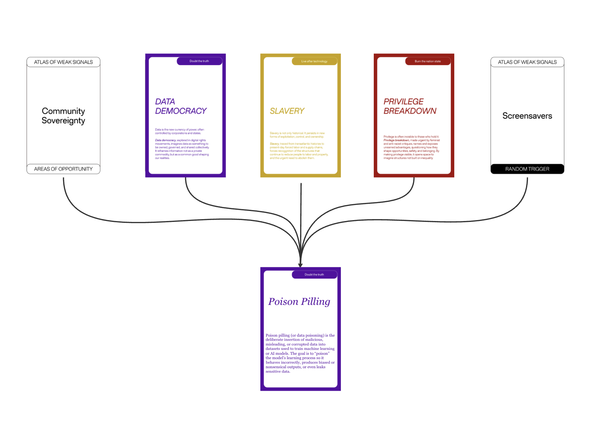

# Atlas of Weak Signals

---

=== "AOWS 1"

    ## Group Atlas of Weak Signals

    ### AOWS 1 (*October 2025*)

    *Group: Beste, Ayal, Agnese, Max, Heba, Aiman*

    **Poison Pilling**

      

    Description: Poison pilling (or data poisoning) is the deliberate insertion of malicious, misleading, or corrupted data into datasets used to train machine learning or AI models. The goal is to “poison” the model’s learning process so it behaves incorrectly, produces biased or nonsensical outputs, or even leaks sensitive data.

    *The definition was copied from ChatGPT when asked: “Do you know what poison pilling is as it relates to putting in data that messed up ai data training?”*

    We later asked ChatGPT how it felt about this practice. Ask us if you want to read its response.

    https://chatgpt.com/share/6937e4f3-3b4c-8009-a287-3997a9f7259c

    #### Visual representation

    

=== "AOWS 2"

    ## Group Atlas of Weak Signals

    ### AOWS 2 (*December 2025*)

    *Group: Beste, Ayal, Agnese, Max, Heba, Aiman*

    **Open-Source Sufficiency**

    

=== "5 Weak Signal links"

    ## 5 Weak Signal links to Earth Belonging

    **1. Soil Sealing & Rain Management**

    *Weak Signal - AOWSMW01: soil sealing and rain as resource*

    Soil sealing is the idea that we are suffocating the soil of the Earth by creating an impermeable skin or layer on top of it in order to make way for urban development. As a result, the Earth’s stratum struggles to “breathe” and sustain its natural systems, which also leads to ‘heat island effects’ caused by urbanization. In the modern world, soil sealing is normalized as part of the growth and development that happens in cities, which needs to be challenged. 

    In parallel, in some contexts rainwater is neglected and treated as a hazard or waste. Systems are built to pull it into sewage systems and the gutters as fast as possible to avoid flooding and water overflow in cities. However, rain should be viewed as a valuable resource to be captured, filtered and stored. Urban design needs to accommodate the integration of rain as a vital resource through concepts like ‘sponge cities’ to feed the water back to the earth’s soil. 

    Combining soil unsealing with the harvesting of rain resources will help the Earth restore its natural sustaining cycles, which in turn will help our civilization restore nature’s physical cycles and improve our psychological sense of belonging to it. 

    **2. The Anthropause**

    *Weak Signal - EE02: that during the pandemic when every big city was empty how the animals went back enjoying a world and spaces that belong to them first*

    While many viewed the recent COVID-19 pandemic as a tragedy, from a different perspective it was also a moment of liberation for both humans and other species alike. The ‘pause’ in the Anthropocene and in dominant human activities like movement, pollution, consumerism created an ‘Anthropause’.  The forced ‘slow-down’ allowed animals to reclaim urban space, and in turn, the world more freely without the control of humans. Similarly, it was an opportunity for humans to return to the earth, the very fabric of which we are made, allowing the reclamation of our connection to the ecological biosphere and rebuilding our sense of belonging to Earth. 

    **3. Authentic and Spurious Frames**

    *Weak Signal - AOWS-AK-02 The distance between authentic and spurious frames*

    There is no denying the gap that exists between our biological planetary reality and the artificial reality of our modern way of life. In contemporary urban design, we often lose the ability to distinguish between the two as we encounter a “blur effect” where the line between these two concepts disappears. Corporate green walls are a prime example of spurious frames; they act as visual filters through which we perceive reality, lacking the raw honesty of the biosphere and the Earth. 

    Bridging the gap between authentic and fake, nature and the artificial, means stripping away these synthetic masks and allowing ourselves to reconnect with the biosphere and rediscover our position within the Earth’s self-sustaining cycles. We must challenge ourselves to move past the sole image of sustainability towards a raw and honest engagement with the biosphere. Alienation is the enemy of interconnectedness. By choosing the authentic over the spurious, we reclaim our role as biological participants rather than mere spectators of a simulated world. 

    **4. Agradecemos and Decolonizing Time**

    *Weak Signal - AOWS LW02- Agradecemos: Decolonizing time practices — slowness, circularity, ancestral simultaneity*

    Agradecemos or “we give thanks” is a ritual of gratitude that helps us shift our mindset; from a mindset of extraction of time by ‘taking it’, to one of mutual reciprocity where we ‘honor it’. While the standard modern clock imposes a system of control and commodification, we can resist the dominant utilitarian relationship with time by allowing ourselves to reconnect with our human core, our biology, and our ecology. Reclaiming biological ways of living that prioritize connection with nature can serve as tools for the decolonization of these time practices. 
    
    Healing from alienation and the negative effects of the hyperlinear modern world can happen through ‘slowness’ practices, acknowledgment of our place in a circular biosphere, and sensory interactions with the Earth. One walk in nature forces us to sync with the slow time of the biosphere rather than the fast time of the clock. 
    

    **5. Loss of Heritage and Nature**

    *Weak Signal - BC increasing dis attachment from heritage because of rapid construction projects and loss of nature*

    Rapid urban development can erode the deep cultural and ecological ties humans have to their environment. The removal of the living memory and identity of a community that lives in physical landmarks, traditional shops or communal gathering spots creates a growing sense of alienation. Loss of heritage erases critical anchors of people’s identities. Similarly, when nature is replaced by concrete and spurious material, the authentic frame of human existence is lost. We forget our biological roots and cycles, which form essential parts of our history and identity, and in turn, lose our sense of self. 
    
    Heritage and nature are the invisible threads that sustain our sense of belonging. Rapid urbanization contributes to the erasure of our place on Earth. Resistance through reconnecting to Earth’s physical matter can help us pull and tighten these threads, anchoring our identity within the living biosphere. 
    