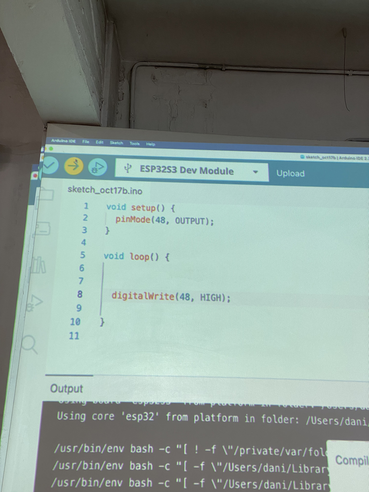
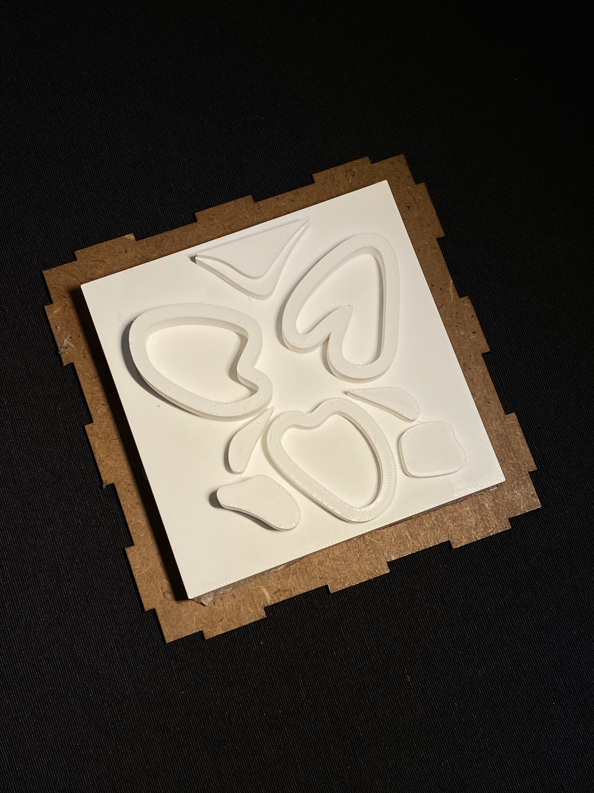
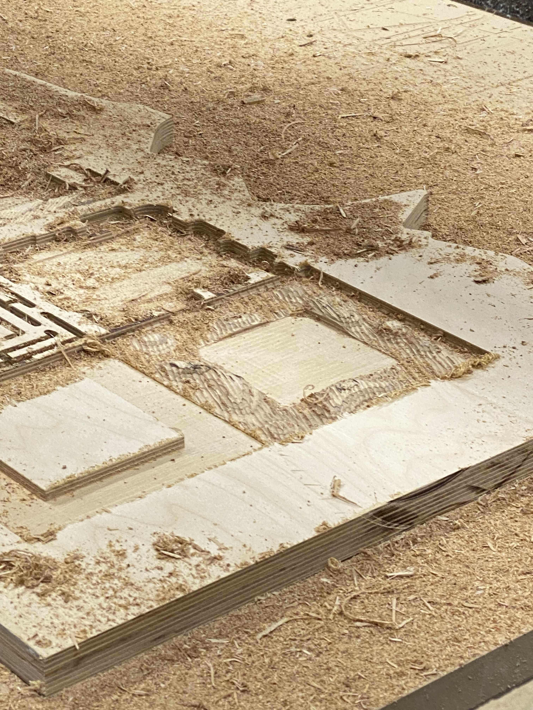
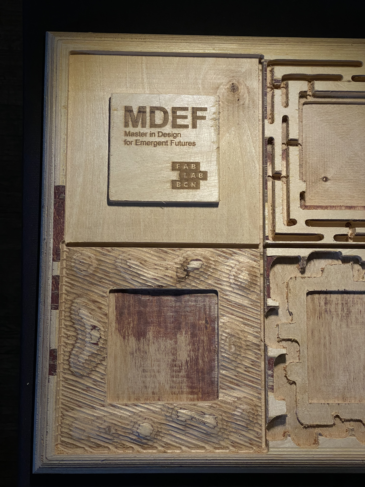

=== "Summary"
 
    

    The Fundamentals for Future Makers course is our first introduction to fabrication tools and technologies as students in the MDEF program. However, given my background, I was already familiar with some of these technologies and tools from my undergraduate studies. Nevertheless, it was useful to have a course like this to serve as a refresher on how to use these technologies, since it has been quite a while since I used any of them. I will admit at first I was a little worried I lost my confidence with using them, but just a quick refresher and it felt like no time had passed.
    While I was familiar with certain aspects like laser cutting, 3D printing, 2D & 3D Design, casting and molding, things like working with coding on Arduino, building multimedia experiences on Touchdesigner and biomaterial creation were completely new to me and I was very much fascinated by them. I am very happy we were exposed to them because they defintely opened up a lot of new avenues.

    Over the course of the nine sessions, we worked with several technologies, each time working towards completing a certain task, most times having to complete them within the same session. I would say they were pretty focused and productive sessions, but also FUN - you can't have fundamentals without the fun. Detailed below is a brief take away and documentation of the sessions.

    ### Reflections
    Overall, I think I really enjoyed this course because it felt like a good ice breaker in between all the other courses that demanded a lot of brain power and deep thinking. It felt nice to just break away and focus on making things with our hands. Working in small groups was also enjoyable and it made me realize how different our approaches can be to a simple assignment. 
    I think working with Ayal I learnt to achieve a balance between doing something nice but not necessarily complicated. I appreciate how we were assigned simple tasks to learn how to use each technology or tool and had a tangible outcome by the end of each class. 
    One reflection is that I wish we knew from the beginning of the course that every thing we make would somehow connect to the next technology we use because then maybe we could have been more mindful of our design choices. But regardless, a lot of learning from the mistakes and the frustration, but also had a lot of fun!

=== "Arduino & Coding"
 

    First time ever working with coding and Arduino. Before this class, I never even heard of a software called Arduino.
    At first I was very frustrated with how long it took just to get the program installed on my laptop. I may have also been slightly intimidated by the fact that this is something I have never ventured into at all, not even in the slightest. I was completely out of my comfort zone. Everything was taking much longer for me and it made me feel like I wasn't getting it. But then when I finally got the Barudino LED to flash, it felt great. 
    I would say I still have a lot to learn when it comes to coding and Arduino, and I wouldn't say I gravitate towards it, but it is defintely something I would like to work on improving. Unfortunately, I don't have any photos or videos of my Barduino working, just a photo of the instructions we were following from the screen while Dani was explaning. 

    

=== "2D Design & Fabrication"

    2D Design and Rhino is something I am very familiar with, so this felt like something I could do with my eyes closed. It was nice to know what was going on after the Arduino session.
    Since I'm already proficient in Rhino, from early on in the session I started looking into the kind of pattern I wanted to make. Did a little research first online and decided I wanted to do a geometric pattern inspired by "mashrabiyas", which are architectural screens with patterns that are characteristic of traditional Islamic architecture. The one I did kind of resembled flower petals and the spacing between the petals was relatively small, but we tested it out on the laser cutter regardless. It was a good test to see if the laser cutter could handle such small tolerances. Somehow it survived, but the edges were very fragile.

    

    When it came to constructing the box, we ended up using the same pattern for the inside of the box, but to avoid any issues we scaled it up to avoid the small tolerances. We decided to make the pattern all around the internal area, to resemble the repetitive window screens, and just played with the name on the box. This was a simple and straightforward task. The thing I learnt was that the tolerances were still quite small and its best to avoid such small patterns unless absolutely necessary. The construction of the box was a bit of a back and forth and felt like a puzzle, because the pieces weren't exactly fitting. Eventually, we got it all together and voila! We ended up with the box in the image.

    

=== "3D Design & Printing"
 
    3D Design & Printing is also something I'm very used to working with. 3D printing in particular is something I enjoy doing, even though it can get taxing. As for 3D printing, this is something I needed to brush up on from my undergraduate. 
    Even if we are using the same kind of technology, the settings, programs, and setup for the machine varies in different facilites. So it was good to have this course to make sure we knew how to use these particular machines correctly.
    For the design, we decided to create something on the same theme of the flower petals from the 2D design we laser cut previously. It turned out simple, abstract but pretty!
    
    

=== "CNC Milling"
 
    CNC Milling is a machinery I had touched on in the past but not mastered. I was honestly a little scared of it because the machine was big and intimidating. I think through this step by step walk through it became a little less intimidating, but defintely a couple things to wrap my head around, like the stepover and step down and the importance of running a preview of how the machine will move before sending it to cut.
    For the design, we decided to create organic shapes, almost resembling a mountain, for the flower to sit in.

    

    

    

=== "Casting & Molding"
    
    I had previously worked with casting and molding different things like plaster, concrete and resin, but not silicone. 
    I think the flexibility and qualities of silicone are great for a lot of different uses and I'm glad we were encouraged to work with it because I realize its a great tool for molding!
    Challenges we faced were that the silicone was leaking from the mold quite a bit and that we decided to keep the laser cut 2D pattern inserted on the side of the mold, which ended up being not such a great decision because it made it very difficult to take out later upon completion. That small pattern caused us a little trouble, but now we know better than to use such a small repetitive pattern when casting silicone.

     

=== "Touchdesigner"

    Although this was a quick one class, I think we learnt a lot and enjoyed it. Personally, I was really happy we were introduced to the program and given a little crash course in it because I can see myself using it in the future for audiovisual translations and interactive experiences. 
    I'll still need to put a little more time into getting more familiar with the program, but for now this is a good start!

    (video here)

=== "Biomaterials"

    The biomaterials session was probably my favorite one of all the fundamentals sessions. Super fun, experimental and exciting.
    It was fun to see all the crazy things people were putting into their mixtures, like shrimp shells, and coming up with.
    Since we had holes in our silicone mold, we decided to cast outside of it not to risk messing it up. We ended up making a material composed of pine resin, spirulina and tea. It actually turned out pretty nice, especially love the dark color! However, for some reason even though its solidifed, its not held together very well and parts of it fall off everytime we try to move it. We think it might be because we put too much alcohol, but we're not exactly sure. It would be fun to try to recreate this material again with different proportions and see if we can address this issue. 
    I defintely see myself going back to the biolab to experiment with different materials and I'm excited to make my own materials!

  

  

