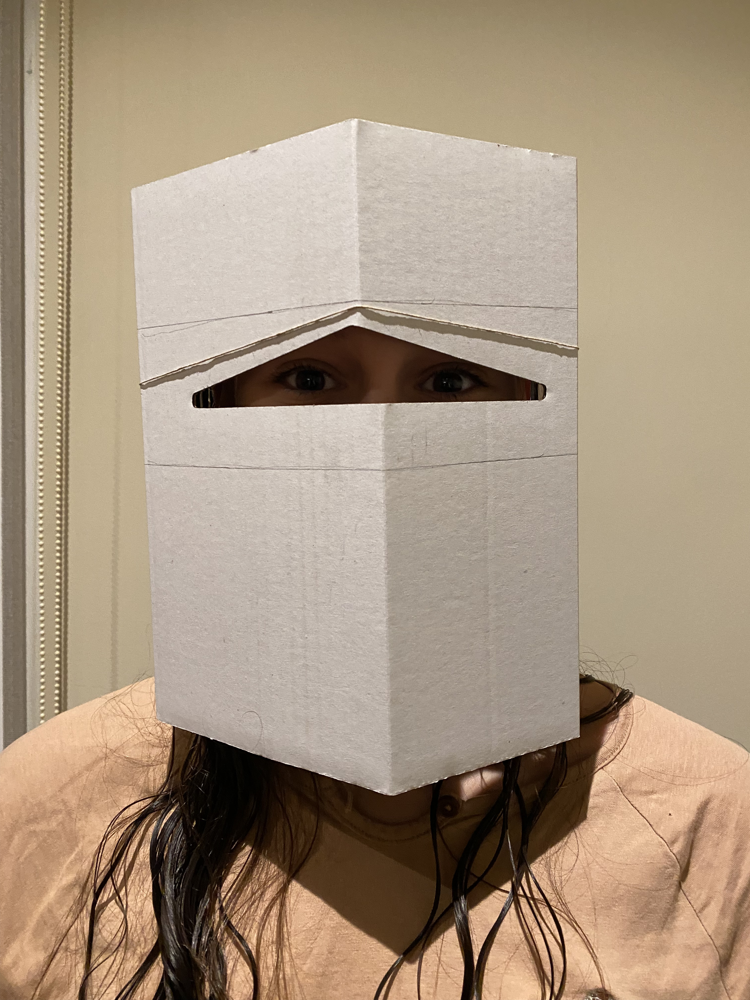

# Living with your own ideas

---

=== "October 28"

    
<strong>BECOMING THE BEST VERSION OF MYSELF</strong>

    ## The Aligned Self

    

    
    
    
    

    ## The Distraction Filter

    

    
    
    
    

=== "October 29"

    
<strong>BECOMING SOMETHING ELSE</strong>

    ## BECOMING EARTH

    

    
    
    
    

=== "October 30"

    
<strong>TO JUDGE AND BE JUDGED</strong>

    ## SUBJECT - HEBA ELIDRISI

    My idea on how I wanted to be perceived changed many times while we were supposed to be brainstorming. 

    Initially I wanted to be perceived as chill, unserious and nonchalant. But then as time went by I decided I wanted to be playful, careless, almost child-like. (all of this was before my time as a subject began) 

    I used the tape as a prosthetic to play with - I was wearing it on my wrist, waving it around, toying with it. At some point I almost forgot the act and the prosthetic, but I realized something - I did not have to try hard to be perceived in that light because I think I sometimes naturally do it when I'm in a certain mood. 

    I knew who my detective was within the first five minutes of my time as a subject. They tried to approach me subtly but I instantly knew what their intention was.

    ## DETECTIVE - SUBJECT: MELISSA

    **12:10 PM** subject says they are going to chill on the terrace

    **12:15 PM** subject lays on the bench in what looks like an attempt to chill, headphones and sunglasses were used as a means of disconnecting herself from everyone

    **12:24 PM** subject lifts head and removes headphones to listen and speak, engaging in conversation again

    **12:39 PM** the subject has been laying on the bench for the past 20 minutes, connecting and disconnecting from the conversations happening

    **12:42 PM** the subject moves their headphones over their face and away from their ears to look at other people speaking and listen to what they are saying, then looks at me. I thought she noticed me taking a picture but she didn't

    **12:51 PM** subject asks me if I am following someone or being followed. I tell her I am being followed in this round and she believes me, doesn't seem suspicious

    **12:55 PM** subject asks me what time it is, I tell her it's 12:55PM and that we need to head back to class. She lays back on the bench, takes a while to get up then starts moving

    **12:57 PM** on the way to the stairs subject discusses who she thinks is following who, but does not suspect me at all, I think to myself mission successful.

=== "Final Reflections"

    
<strong>FINAL REFLECTIONS</strong>

