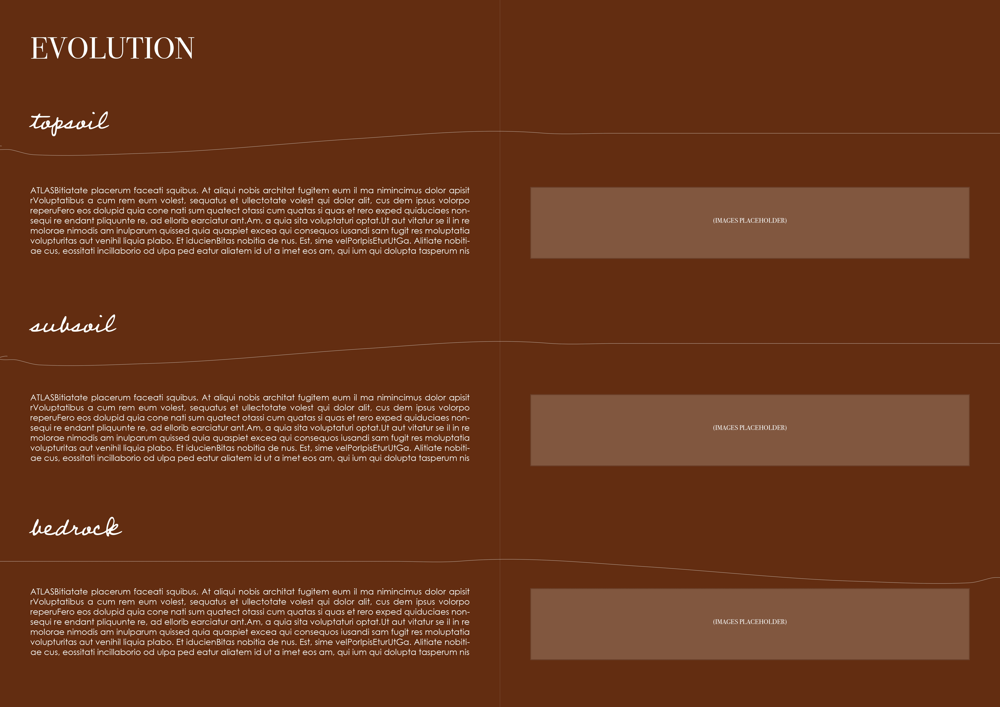
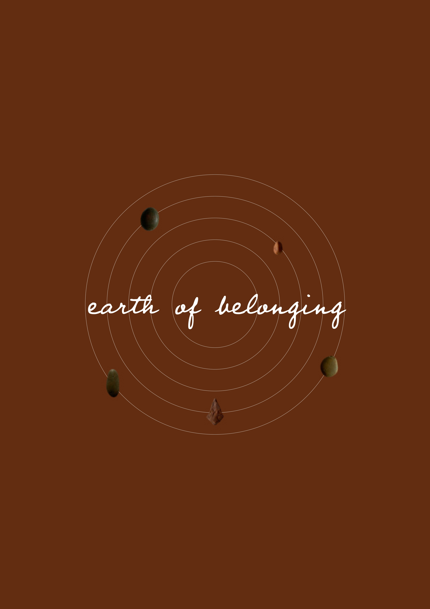
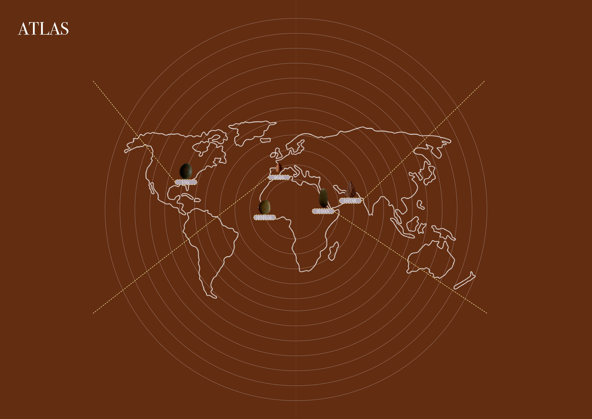
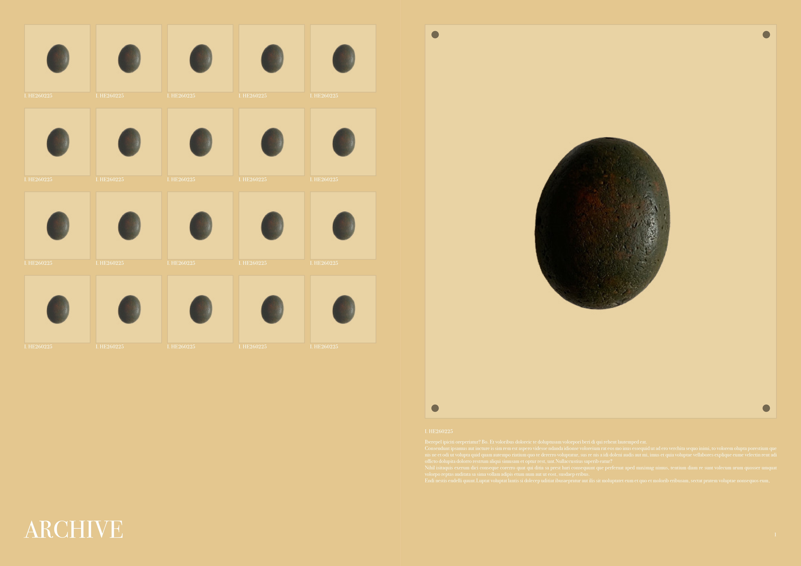
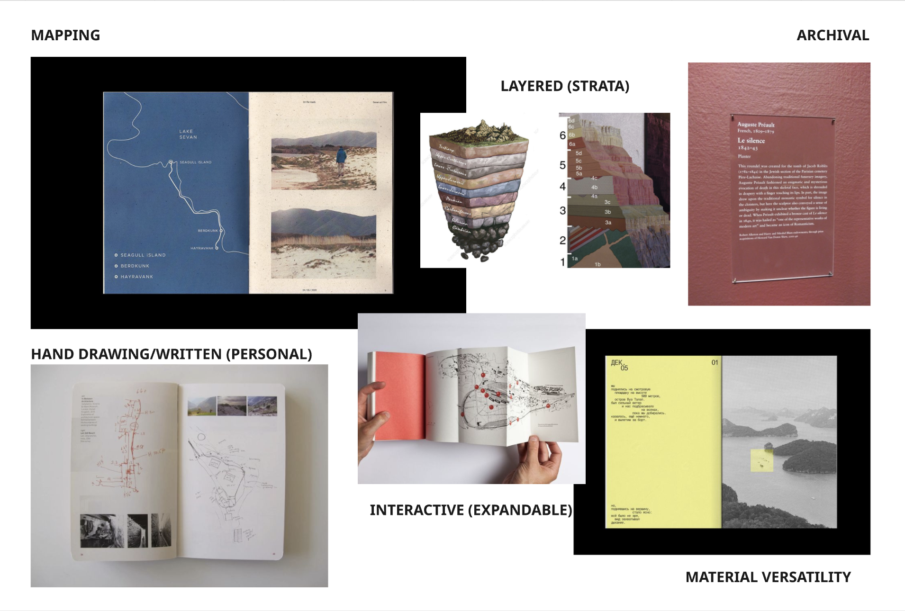

## Pictorial

    

        
    

    

        
    

    

        
    

    

        
    

    
    ...

    <a class="prev" onclick="plusSlides(-1)">&#10094;</a>
    <a class="next" onclick="plusSlides(1)">&#10095;</a>

1 / 4

## Peer Interpretation Snapshot (Ayal)

### Abstract & References

#### Abstract

I envision my pictorial resembling a museum catalogue that represents the relationship between objects, earth material and human memory. The pictorial would treat the material objects as condensed archives of time and narratives. The content would be centered around the visual typology of the selected objects, with classification labels and associated narratives to build the archive. I want to use the catalogue style to define the structure while creating a simple but legible pictorial. Objects will be visually divided into different sections of physical appearance, origins, associated human memories, and abstracted visual study. The reason I want to use this structuring style and organization is to allow the material’s complexity to shape the visual realm and create a flexible archive of contents. 

#### References

