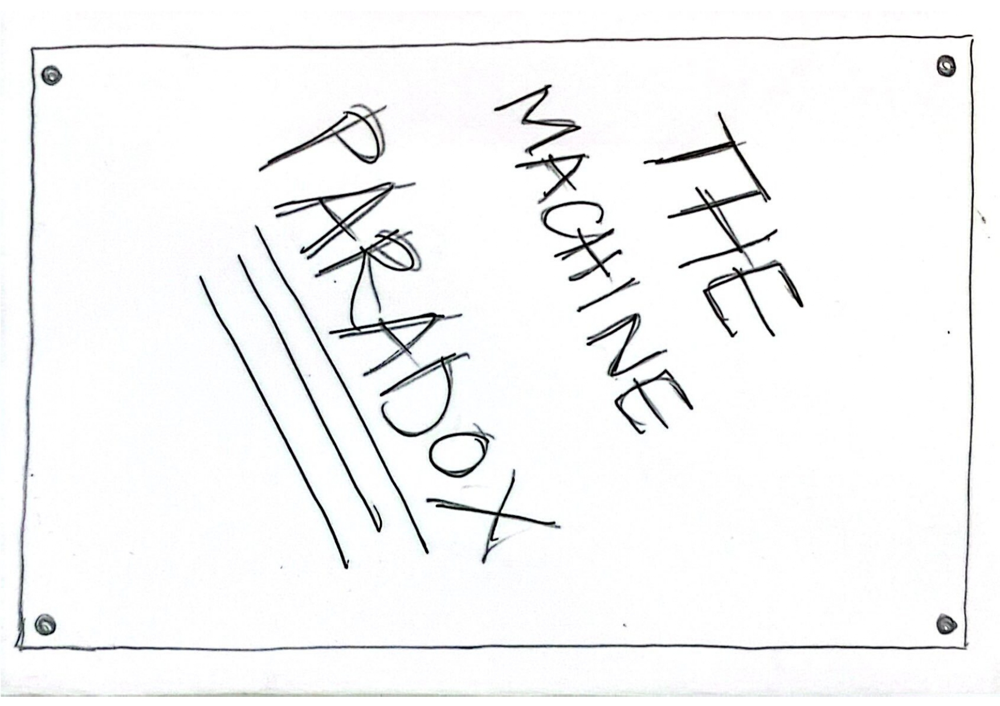
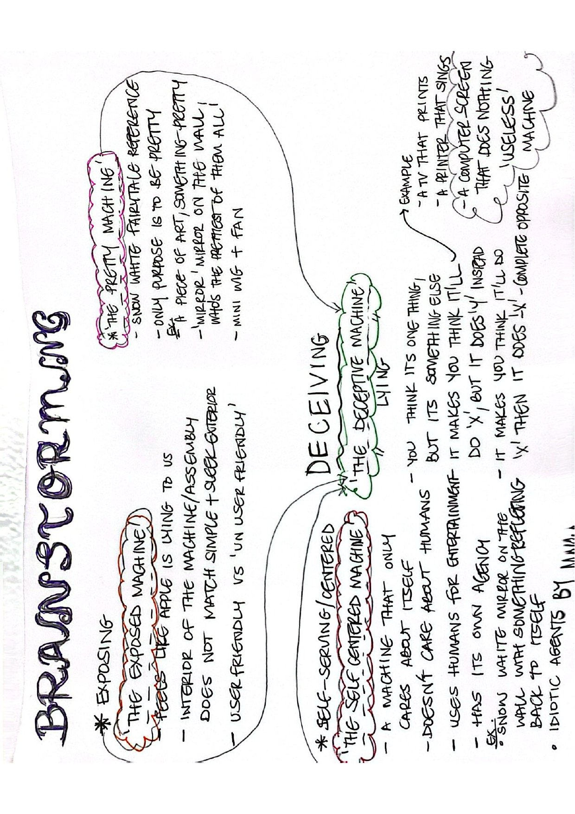

# Unpacking Tech Systems

---

=== "Unpacking Intelligent Machines"

    ## Apple Macbook

    ### *(13-inch, Late 2009) No. A1181*

    - [Forensic Report](https://hackmd.io/@M_mbpDG9RfCkv3Hh2okOvw/BkdWfLolbe)
    - [Inventory](https://docs.google.com/spreadsheets/d/1nhxFCAaLnu5iB0xfygtxfu7oa6Qrs6oYqWyNHF1m7AE/edit?usp=share_link)

    Unpacking the Intelligent Machine was an eye opening experience, to say the least. I never envisioned myself disassembling any kind of technology, not necessarily because I was too intimidated to do it, although that definitely is one factor, but because it's something that never crossed my mind. Throughout my life, I've only ever seen people like my youngest uncle attempt to do this, but on a much smaller scale and he never went nearly as deep as we did during this week, which is the complete disassembly of all the components that keep the machine together. The only other time I might have seen a little bit of the inside of a laptop specifically, is probably when I would have an issue like my motherboard isn't working or the battery needed replacement. Even then, I had only gotten a sneak peak of what the insides of a laptop looked like and most of the work was done 'in the back'. I always thought the idea of disassembling a machine was cool but never really had the urge to do it. Mentally I thought this was something reserved for technology experts and people that would know how to handle this safely.

    When faced with the task of choosing a piece of technology to 'unpack', I found myself gravitating towards the 'old' Apple MacBook, maybe because I love and appreciate everything so many things about Apple's MacBooks and I own one right now. So I think I tried to convince everyone else on the team to get onboard with the MacBook. Little did we know what was in store.

    Although this is something I was a little confused by at first, I have to say I ended up enjoying it a lot. I think I didn't expect myself to enjoy it as much as I did, but it was a great learning and eye opening experience. The two weeks overall were very enjoyable to me, and probably one of my favorite courses so far in the program. Now I feel like the stigma of disassembling a machine is gone and it doesn't feel intimidating. Would I do it again by myself for fun or experimentation? Why not.

=== "The Machine Paradox"

    ## Meluza

    ### *The Deceptive Machine*

    ### Video

    

        <iframe style="position: absolute; top: 0; left: 0; width: 100%; height: 100%;" src="https://drive.google.com/file/d/1aW3gkNi_JAU18vEawTKH0_QISoeVeGH6/preview" frameborder="0" allowfullscreen></iframe>
    

    ### Presentation

    - ['Meluza' - The Deceptive Machine](https://docs.google.com/presentation/d/15L3aPrOG1Eg2wkkGKGjhqTKlLL-P-4r6/edit?usp=share_link&ouid=117541423030685553140&rtpof=true&sd=true)

    ### Zine

    

    

    

    

    
