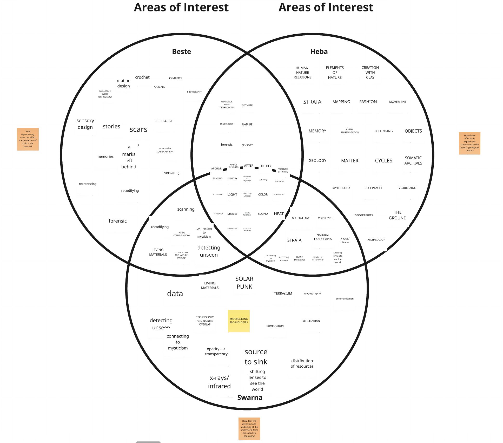
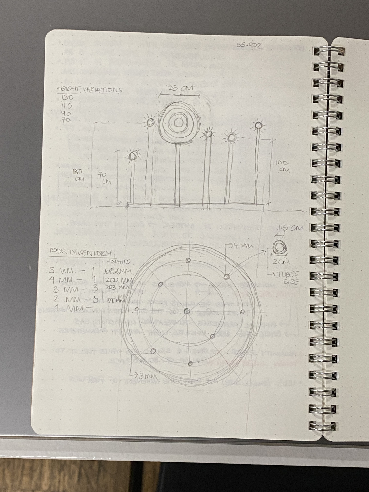
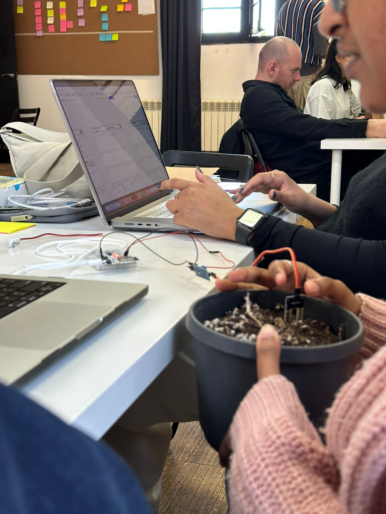
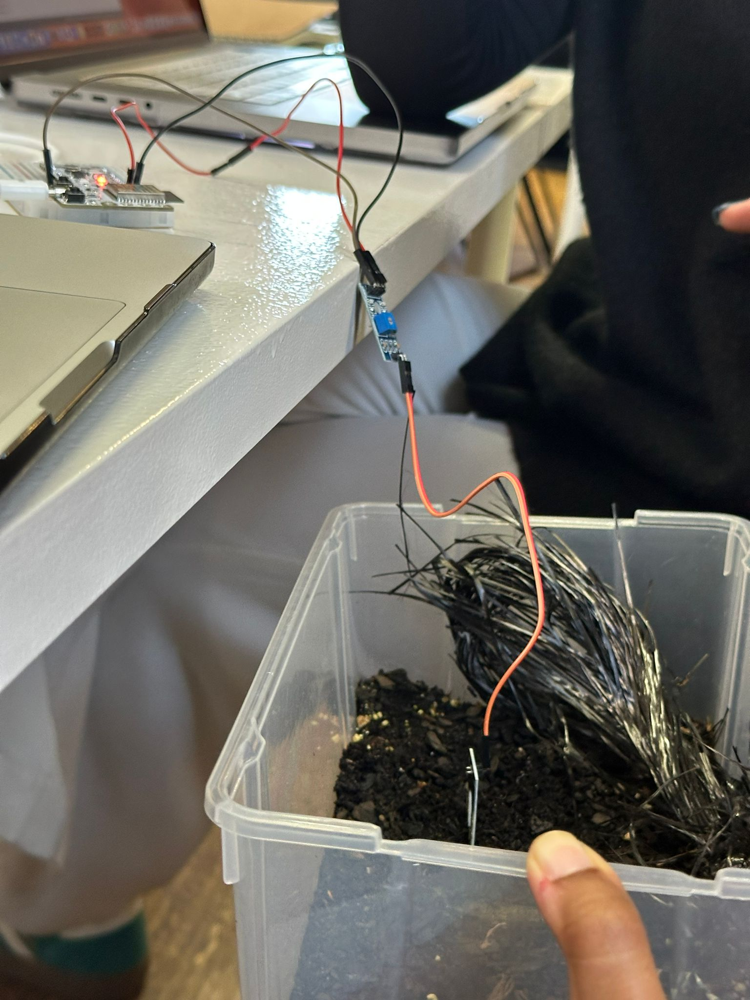
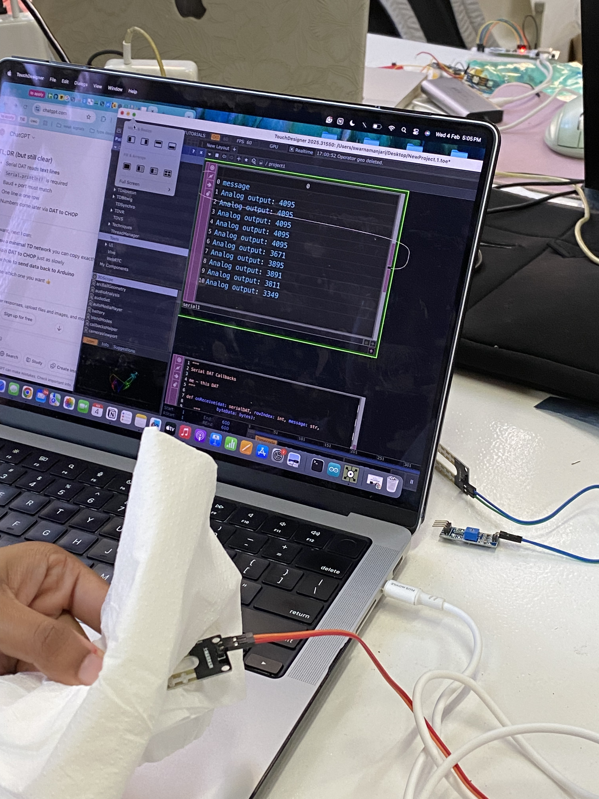
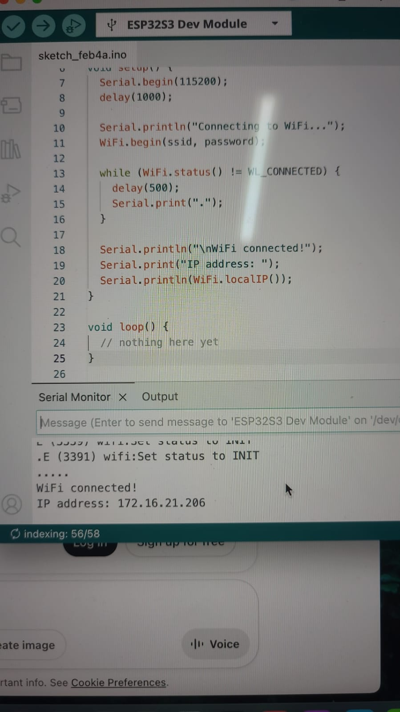
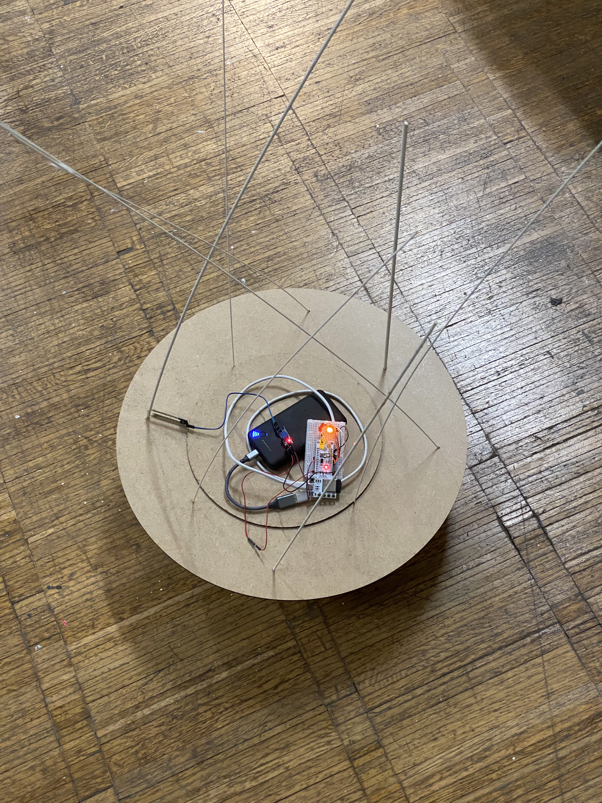
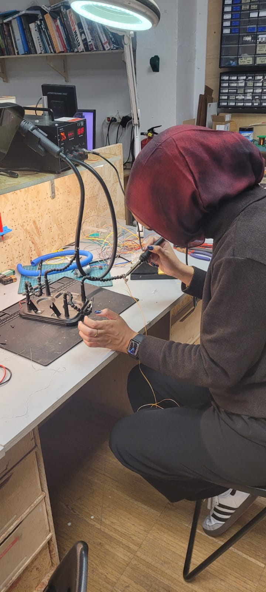

# Cognitive Orgies

## *“Echoes of Earth”*

Emerging from an initial desire to visualize underground tree roots and evolving into a sensory portal to foster deep connection with the planet, ***Echoes of Earth*** is a soil sensing device that reads ground data and transforms it into light and sound outputs through remote communications. Mimicking the fireflies that fly in open fields, the sensing device reflects the soil moisture levels and activates the light situated on top of the reed-like structure to communicate what is being sensed in the ground. Intended to be placed outside in fields between the trees, the device invites people passing to stop, look and realize: there is always activity happening in the underground Earth and it is calling out to you. As an additional layer, the device communicates the data remotely to a screen, creating a root-like structure that emits a sound resembling echoes and visceral calls. The visual is of a living breathing root that speaks to you wherever you are. 

### **Process, Evolution & Traces**
- [Hackster.io Repository](https://www.hackster.io/544134/echoes-of-earth-099b88)*

The first brainstorming session was interesting and a good head start for the upcoming week. Upon mapping out our individual interests and discussing similarities, we realized we had several overlapping areas of interest. ***Sensing, translation, surfaces, light and ground*** were some of the common words that emerged from the intersection of our interests. Interestingly enough, one of the strongest ideas that emerged from these initial discussions was fireflies. After doing some research, we learnt that fireflies are bioindicators that reflect the overall health of an ecosystem through their presence, absence and behavior. This particular idea invoked some sort of excitement in us and I left feeling that we had a clear idea to kick off the micro-challenge with. 

When we resumed the ideation process on the first day of the challenge week, we picked up where we left off but the discussion started to shift a little bit, which is part of the process. A first cognitive challenge and a struggle for us as a group was trying to bridge the connection between the fireflies concept and our design research areas to justify the ‘why’ question. By the end of the ideation session on the first day, we arrived at something slightly different: a scanner of multi-scalar interfaces that reads multiple inputs such as temperature, sound (possibly more) and translates it into multiple outputs – light, color, sound (possibly more). The intention was for it to read ground matter, both the underground world linked to Swarna’s research and geological matter connecting to my research, as well as human scars, to link to Beste’s research. It wasn’t until we presented the concept and were confronted by a number of questions that we didn’t have clear answers to that we realized the concept was lacking clarity. In an attempt to make it adaptable and moldable to each of our research projects, we left it too open ended. In all honestly, from this moment forward we struggled to gain clarity on exactly what it is we were trying to do and felt stuck in a constant loop of discussions and doubts. I also personally struggled to completely let go of the idea of the fireflies and the lights because it felt like the point we all strongly connected to and my intuition told me it was our strongest point. 

### **Technical Execution**

Whilst discussing task divisions and strategies for prototyping, we found ourselves struggling to fully define the project, which I for one did not want to have to discuss with anyone until there was a clear direction. Here is where I learnt something else: discussing with others helped us understand our limitations and our avenues of possibility. After explaining our desire to map underground roots to Santi & the team, we realized the limitations. This is not something we could construct with the time and tools we had available. Suggestions to read alternative ground data like soil conductivity and manipulate that information to say we were mapping roots seemed ethically wrong and dishonest. After discussing it amongst each other and evaluating our main intention to build a connection to the ground, we agreed to look at it through another lens: a translation of a different form of ground data into a visualizations of the roots. Soil moisture levels are in fact a direct indicator of the underground environment where tree roots function. Much like fireflies, they reflect the health of the root’s environment. Ultimately, this is the moment where we rewrote the question: rather than mapping underground root paths, what if we monitor their health?

Based on our strengths, Beste took on the visualization development, I worked on the design and build of the physical artifact and Swarna smoothly bridged between the physical inputs and the digital outputs through sensors, coding and connections. Even though we were all responsible for one part, we worked together seamlessly through many of the tasks to bridge any gaps and amplify our strengths. 

One thing I enjoyed dabbling with was setting up the soil moisture sensor. Electronics and coding is not friendly territory for me, but I wanted to tackle that head on. Through initial online research and some help from Andres, I was able to get the moisture sensor working and ready to test in different soils. This was a huge accomplishment for me. 

Aside from a few questions about if things were set up correctly, I hardly used artificial intelligence throughout this whole experience, which only felt right since we’re talking about connecting to the Earth. From there, I handed it over to Swarna and she worked her magic with the coding. 

We got a lot of help from Mikel to get the lights set up - we played a lot with the way the LED’s would react to the soil moisture readings and also the connections to the Barduino board from the top of the reed-like structures. Since the connections were quite flimsy, we had to solder cable connectors to the LED wires that connect to the Barduino board . We also used clear wires to tighten the electrical wires to the reeds to keep them stable for the presentation. Through the support from the FabLab team, we were able to break through both the mental and physical blocks. Thank you Santi, Mikel, Andres, Julia, Damian. 

### **Finalmente**

The result was a magical experience that used storytelling, electronics and technology to elicit a sensory experience of connecting to the Earth. Surely enough, we did come back to the idea of the fireflies, which was a full circle moment, especially considering all of the challenges we encountered along the way with the conceptualization. 

Although I am satisfied with the simplicity and effectivity of the artifact, future iteration ideas include integrating a physical housing to encase the brain: the barduino, wires and connections. Additionally, improving the LED connections to ensure they are well secured to the board is another priority. To elicit more immediate reactions in the device and integrate an additional influence to the output, the addition of proximity or movement sensors would be nice to add another layer of input to the device and allow for a more human-interactive intervention. 
