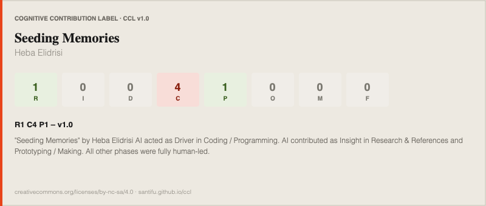

# Cognitive Orgies

=== "Cognitive Orgies I"
    
    ## *“Echoes of Earth”*

    Emerging from an initial desire to visualize underground tree roots and evolving into a sensory portal to foster deep connection with the planet, ***Echoes of Earth*** is a soil sensing device that reads ground data and transforms it into light and sound outputs through remote communications. Mimicking the fireflies that fly in open fields, the sensing device reflects the soil moisture levels and activates the light situated on top of the reed-like structure to communicate what is being sensed in the ground. Intended to be placed outside in fields between the trees, the device invites people passing to stop, look and realize: there is always activity happening in the underground Earth and it is calling out to you. As an additional layer, the device communicates the data remotely to a screen, creating a root-like structure that emits a sound resembling echoes and visceral calls. The visual is of a living breathing root that speaks to you wherever you are. 

    
    

    ### **Process, Evolution & Traces**
    - [Hackster.io Repository](https://www.hackster.io/544134/echoes-of-earth-099b88)*

    

    The first brainstorming session was interesting and a good head start for the upcoming week. Upon mapping out our individual interests and discussing similarities, we realized we had several overlapping areas of interest. ***Sensing, translation, surfaces, light and ground*** were some of the common words that emerged from the intersection of our interests. Interestingly enough, one of the strongest ideas that emerged from these initial discussions was fireflies. After doing some research, we learnt that fireflies are bioindicators that reflect the overall health of an ecosystem through their presence, absence and behavior. This particular idea invoked some sort of excitement in us and I left feeling that we had a clear idea to kick off the micro-challenge with. 

    

    When we resumed the ideation process on the first day of the challenge week, we picked up where we left off but the discussion started to shift a little bit, which is part of the process. A first cognitive challenge and a struggle for us as a group was trying to bridge the connection between the fireflies concept and our design research areas to justify the ‘why’ question. By the end of the ideation session on the first day, we arrived at something slightly different: a scanner of multi-scalar interfaces that reads multiple inputs such as temperature, sound (possibly more) and translates it into multiple outputs – light, color, sound (possibly more). The intention was for it to read ground matter, both the underground world linked to Swarna’s research and geological matter connecting to my research, as well as human scars, to link to Beste’s research. It wasn’t until we presented the concept and were confronted by a number of questions that we didn’t have clear answers to that we realized the concept was lacking clarity. In an attempt to make it adaptable and moldable to each of our research projects, we left it too open ended. In all honestly, from this moment forward we struggled to gain clarity on exactly what it is we were trying to do and felt stuck in a constant loop of discussions and doubts. I also personally struggled to completely let go of the idea of the fireflies and the lights because it felt like the point we all strongly connected to and my intuition told me it was our strongest point. 

    ### **Technical Execution**

    Whilst discussing task divisions and strategies for prototyping, we found ourselves struggling to fully define the project, which I for one did not want to have to discuss with anyone until there was a clear direction. Here is where I learnt something else: discussing with others helped us understand our limitations and our avenues of possibility. After explaining our desire to map underground roots to Santi & the team, we realized the limitations. This is not something we could construct with the time and tools we had available. Suggestions to read alternative ground data like soil conductivity and manipulate that information to say we were mapping roots seemed ethically wrong and dishonest. After discussing it amongst each other and evaluating our main intention to build a connection to the ground, we agreed to look at it through another lens: a translation of a different form of ground data into a visualizations of the roots. Soil moisture levels are in fact a direct indicator of the underground environment where tree roots function. Much like fireflies, they reflect the health of the root’s environment. Ultimately, this is the moment where we rewrote the question: rather than mapping underground root paths, what if we monitor their health?

    Based on our strengths, Beste took on the visualization development, I worked on the design and build of the physical artifact and Swarna smoothly bridged between the physical inputs and the digital outputs through sensors, coding and connections. Even though we were all responsible for one part, we worked together seamlessly through many of the tasks to bridge any gaps and amplify our strengths. 

    

    
    
    
    

    One thing I enjoyed dabbling with was setting up the soil moisture sensor. Electronics and coding is not friendly territory for me, but I wanted to tackle that head on. Through initial online research and some help from Andres, I was able to get the moisture sensor working and ready to test in different soils. This was a huge accomplishment for me. 

    

    
    
    

    Aside from a few questions about if things were set up correctly, I hardly used artificial intelligence throughout this whole experience, which only felt right since we’re talking about connecting to the Earth. From there, I handed it over to Swarna and she worked her magic with the coding. 

    

    
    
    
    

    

    
    
    
    

    We got a lot of help from Mikel to get the lights set up - we played a lot with the way the LED’s would react to the soil moisture readings and also the connections to the Barduino board from the top of the reed-like structures. Since the connections were quite flimsy, we had to solder cable connectors to the LED wires that connect to the Barduino board . We also used clear wires to tighten the electrical wires to the reeds to keep them stable for the presentation. Through the support from the FabLab team, we were able to break through both the mental and physical blocks. Thank you Santi, Mikel, Andres, Julia, Damian. 

    

    
    
    

    ### **Finalmente**

    

    The result was a magical experience that used storytelling, electronics and technology to elicit a sensory experience of connecting to the Earth. Surely enough, we did come back to the idea of the fireflies, which was a full circle moment, especially considering all of the challenges we encountered along the way with the conceptualization. 

    

    
    
    
    

    Although I am satisfied with the simplicity and effectivity of the artifact, future iteration ideas include integrating a physical housing to encase the brain: the barduino, wires and connections. Additionally, improving the LED connections to ensure they are well secured to the board is another priority. To elicit more immediate reactions in the device and integrate an additional influence to the output, the addition of proximity or movement sensors would be nice to add another layer of input to the device and allow for a more human-interactive intervention. 

=== "Cognitive Orgies II"
        
    ## *“Seeding Memories”*

    *What if you could whisper your secrets to a tree that promises to store it forever in the depths of it's heart in a language no one else understands? What if you could go back to hear it whisper it back to you again?*

    

    Building off of the ongoing desire to restore a more meaningful relationship with Earth, “Seeding Memories” is a secret memory encrypting system that merges real-time human audio with the living pulses of a tree, forming a private memory archive in the tree - the ecological equivalent of the cloud.

    

    Inspired by the Guardian ‘Tree of Souls’ in Avatar as a space for storing community memory, the intention was to store personal data through encryption to form a secret communication between tree and human, creating an intimacy between the two different intelligences. 

    ### **Process, Evolution & Traces**
    - [Hackster.io Repository](https://www.hackster.io/swarnamanjaric/seeding-memories-0b3c5d)*

    

    Since we already did the exercise of mapping our individual interests in the previous edition, this time we jumped straight into identifying the overlap we wanted to focus on. Individually, we were exploring multi-scalar scars, connection to earth, and the invisible underground. While brainstorming, we discussed ideas of earthly intelligence, ancestral intelligence and ecological intelligence. One particular point that interested us was how historically over time, ecological landscapes are known to have preserved and communicated the stories of ancestors that inhabited the space before. Collectively, we aligned on using natural elements to store memories and respond back. After a back and forth discussion, the tree felt like the right choice to build off of the previous exploration and also because of its alleged wisdom.

    

    When thinking about the physical form and shape of the artifact, we opted for something that resembles the seeds of the avatar tree. Throughout the days and design process, we kept finding tree seeds appear magically in front of us. It felt like some sign from the universe to push forward with this as a visualization of the artifact. To achieve the visual effect from the image of the thin strings of light, we used fiber optic cables that connected to the LED lights, which may be one of the only things we did not have any technical issues with during the developmental process. Black thermal shrinkable sealing boot was used to cover the LED and amplify the light to the cables.

    

    There were a lot of technical resistances and push backs throughout the process that forced us to change path or learn to push back. Cognitive, Moral, Technical. Every trace taught us something. 

    1. The EMG sensor - although we did end up sticking with this sensor till the end and did not change it, maybe we should have. It took Swarna a lot of back and forth, with the help of Mikel, to get it calibrated to get readings that made sense. What’s interesting is that the sensor is very sensitive and it detects micro-voltaic changes. Any loose contact affected the readings drastically. Not only that, but we realized that having the laptop connected to power for charging also affected the sensor reading data, making the sensor weaker. Even though we discussed changing the sensor, we didn’t end up doing it because we wanted to see this one through to the end - a moral decision. In retrospect, we easily could have tested using another sensor. 
    2. Sensor reading plant - since the EMG muscle sensor is intended to be used on humans to detect microvolts from human muscle contraption, the readings it takes from a static plant varies significantly, let alone from a tree. We had to be mindful of this while taking readings from the plant and adjust our expectations accordingly - a mental shift that took us a while to accept.
    3. Amplifier - this was one of the biggest frustrations we had. The idea was that the DF player robot would use the SD card to store the incoming audios, serving as the database for the data, enabling future access and decryption. It didn’t work. Despite several hours and different consultations from Mikel and Adai, the DFplayer was not connecting to the Barduino. We thought maybe something was wrong with that particular DFplayer so we tested two more, three in total. Not one of them worked. A pivot was in order. We decided it was time to let go and find an alternative means. That included the speaker was testing in parallel. 
    4. Program - As a result of the struggle with the DFplayer, we decided to switch programs as well, from Python to TouchDesigner, since TouchDesigner had an embedded option to record data within the program. After we had already modified the live audio data coming in from the headset to a distorted audio using a python code, this also forced us to start over with the coding, hacking and setup of the audio input + output that Beste had already established in Python. However, it was not the only reason for the program switch. When connecting the sensor data to Python, it was stiffer to play with the audio, hence why we decided to switch to TouchDesigner, which has more flexibility in that sense. From Python to TouchDesigner and from speaker to headset. We were forced to change and adapt once again. 

    I appreciate that as a team, we were able to recognize when too much time was being spent trying to hack something and consciously decide when to stop fighting the resistances. We give it our best shot and move on. Acknowledge, Decide, Pivot. 

    ### **Moving Forward**
    I don’t see this as the end for “Seeding Memories”. In its current state, it evokes an emotional response at the mere thought of the intimate connection being shared with the tree. Despite the multitude of technical limitations we experienced this time around, from restrictions on microphones and speakers to data storage and sensor outputs, the conceptual backing is powerful. With all the right inputs, it has the potential to become a mobile tool for communicating with ecological intelligence. One of the key points of the design that we didn’t have the time to finalize but would love to bring to reality, was the technical means of storage. We did not set up the system for storing the original input audios of the shared human memory. However, one of the main purposes of the tree as the ‘cloud’ is to hold the secret memories for access at any time in the future after the interaction for decryption. This is for when you decide to return and hear the tree whisper your memory back to you. 

    

    ### **CCL Badge**

    

=== "Cognitive Orgies III"

    ## *“Sensescape”*

    *Imagining a world navigated through the tips of our fingers and the soles of our feet, leaving our sight behind. Composing live symphonies in real time using our body’s unique movement across natural textures.*

    *image of final outcome

    Stemming from the intention to connect bodily sensations to nature’s raw materiality, “Sensescape” is an interactive multi-sensory installation that translates tactile exploration into live auditory landscapes. The human body is transformed into a conductor of its own environment - the physical equivalent of a musical instrument. Inspired by the tactile playfulness of Twister, the experience guides the creation of live soundscapes based on the placement and movement of participants' hands and feet. 

    *image of twister reference
    *image of dark enclosure reference

    While the initial direction was to immerse participants in a dark enclosure navigated through bare feet, a part of the body we are not accustomed to sensing with, the ultimate intention was to heighten sensory awareness by isolating touch from vision, augmented by real-time audio generation. Every soundscape is entirely unique; no two bodies share the same composition, and no two interactions with the materials will ever yield the exact same acoustic response. An unrepeatable dialogue between the composition of each human body and the textures of the Earth. 

    ### **Process, Evolution & Traces**
    - [Hackster.io Repository](https://www.hackster.io/549006/sensescape-5b950e)*

    After breaking down into smaller groups based on the specific ideas we were interested in exploring, we jumped straight into defining the kind of experience and performance we wanted to create. We focused on the feelings we wanted the live performance to evoke and some of the key words we defined were collaborative, curiosity, triggering, emotional awareness, intimacy and infamiliarity.  

    *insert hexagon tiles reference

    Collectively we looked at references online to visualize a shape/structure for the concept. After coming across an image of hexagonal tiles with different materials placed on them, we decided to go with the hexagon shape; more playful than a square and more usable surface area than a circle. I immediately made some hexagons on Rhino, measured for a size that would work for a bigger foot and hand size and laser cut some prototypes for us to work with. We covered the initial hexagons with aluminium foil to make the units conductive and used those to test the sensors. That was the easiest part. 

    *insert image of hexagons on Rhino

    Throughout the process, we had to push through a number of mental, technical and moral challenges. 
    
    1. The Physical Artifact - The first mental challenge came when we went back to the idea of having the material on each module being concealed so its not seen, meaning the units would need to be three-dimensional or have a depth so materials could be placed inside and not be visible, only accessible through touch. There was a lot of back and forth about whether to make independent modules, wrapped in aluminium foil from the inside with the sensors and electronics inside and only a hole from the top or the side for users to access the material, or to make one unit. Figuring out how to construct multiple hexagon boxes, that would be sturdy enough for people to insert their hands and feet which were also spread across the space seemed very tedious. After discussing amongst ourselves and with the Fab Lab Team, we realized the smarter route to take would be to build one unit with the hexagons as insertion points, channeling the same physical structure as Twister, but with three dimensionality. The construction of the unit involved a combination of tools, including laser cutting, woodworking and manual production. 
    
    2. Sensors - when we first tried to connect one unit to the sensor and get the readings in TouchDesigner to start playing with the sound outputs, it was working just fine. When we then tried to connect more than one sensor at the same time, it was no longer giving normal readings - the values were extremely high and we realized there was something in the code which was mapping the values. After troubleshooting that part, the sensor then wasn’t reading anything when it was touched alone. With Mikel’s help we realized that the circuit needed a ground, so we had to either touch the computer or the barduino board to ground it, which was a really interesting issue. I never knew the sensors needed to be ‘grounded’ to give correct readings. I found this to be a fascinating discovery that could relate to my personal design project and it sparked my curiosity to learn more about this. 
    
    3. Program - one thing we have learnt about TouchDesigner over the course of this program is that it can be notoriously unreliable when it comes to sound outputs. Many times you set something up and it works normally when you are testing it and then when you try to test it another time, it gives a different output or doesn’t work, and it has nothing to do with the sensors or readings its getting. Even though before the final presentations we tested all the sensors and sounds and everything was working fine, right before our time to present, the sound outputs were not working properly. Only one module would generate a sound, or three modules would generate the same sound, which was ruining our intention of each module generating a sound that reflected the nature of the material, for the viewers who cannot see the materials to understand what kind of material was being touched. Unfortunately, we could not resolve the problem for the presentation, but we proceeded with the live performance. Afterwards, Beste did some research and figured out that the issue had something to do with the specific node being used to combine the inputs into one output - we were using ‘Combine Channels’ while we should have been using ‘Combine CHOPS’. Additionally, we needed to add one Math CHOP before each sensor signal to resolve the issue of some modules not producing any sound. 

    ### **Future**
    Although during the presentation there were technical difficulties that did not allow for the creation of the live soundscape in real-time the way we had designed it, Beste was able to resolve all the issues we had faced and set it up successfully for us to use during the live performance of our myth two days after. We used the modules for participants to explore and hear the materiality of the landscape they were immersed in, and the result was beautiful unrepeatable sonic compositions. Every challenge during this process was a valuable lesson that taught us something we never knew about previously. For the future, we know what things to keep an eye out for.  
    I imagine building ‘Sensescape’ as a bigger unit that allows for more participants, ideally 4-6  people at a time, and it becoming a modern day intense and immersive version of Twister. I would love to play it myself in a bigger group and have the full experience with the live audio compositions. 
    
    *if anyone reading this would like to collaborate on taking this further, please reach out and lets make it happen!*

